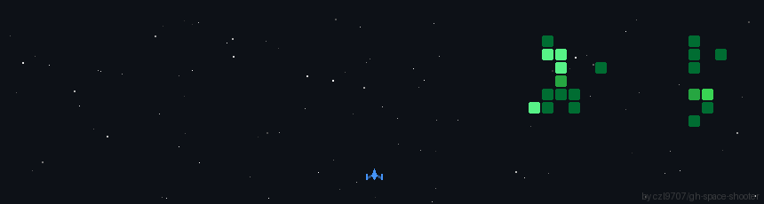

# 👋 Hey, I'm João Gabriel

### Full Stack Developer · Frontend · UI/UX · Design & AI

 

##  About Me

I'm a **Full Stack Developer** passionate about the intersection between **technology, design, user experience and artificial intelligence**.

My journey in development goes beyond writing code. I enjoy understanding how people interact with digital products and transforming ideas into interfaces that are **functional, intuitive, accessible and visually engaging**.

My strongest interests are currently focused on:

-  **UI/UX & Product Design**
-  **Frontend Development**
-  **React & modern web interfaces**
-  **Design Systems & reusable components**
-  **AI applied to design and development**
-  **Responsive & accessible interfaces**
-  **Frontend + Backend integration**
-  **Creative digital products**

I enjoy working between **design and development**, combining visual thinking with software engineering to turn concepts, wireframes and prototypes into real interactive experiences.

I'm continuously expanding my knowledge through projects, experimentation and certifications, including **Design, Full Stack Development and Artificial Intelligence**.

I have a particular interest in understanding not only **how software works**, but also **how people experience it** — from the first visual interaction to the final product.

> **I believe good software is not only about how it works — it's also about how it feels to use.**

---

##  What I Do

<table>
<tr>
<td width="50%" valign="top">

###  UI/UX & CX

I enjoy designing digital experiences with attention to:

- User experience
- Visual hierarchy
- Accessibility
- Responsive layouts
- Design systems
- Components & patterns
- Prototyping
- Interaction design
- Usability
- Visual consistency

</td>

<td width="50%" valign="top">

###  Frontend Development

I turn designs into responsive and interactive interfaces using:

- React
- JavaScript
- HTML5
- CSS3
- Tailwind CSS
- Component-based architecture
- API integration
- Modern UI patterns
- Git & GitHub

</td>
</tr>

<tr>
<td width="50%" valign="top">

###  Full Stack

Although my current interests lean toward frontend and design, I also work with:

- Java
- Spring
- Python
- REST APIs
- MySQL
- PostgreSQL
- Docker
- Backend integration

</td>

<td width="50%" valign="top">

###  Design + AI

I'm interested in exploring how AI can improve:

- Product design
- Prototyping
- Development workflows
- Creative processes
- UI generation
- Developer productivity
- Digital experiences

</td>
</tr>
</table>

---

# Skills

##  Frontend

**HTML · CSS · JavaScript · React · Tailwind CSS · Angular **

---

##  UI/UX & Design

**Figma · Adobe Illustrator · Photoshop · After Effects**

---

##  Backend

**Java · Python · REST APIs · Spring **

---

##  Database & Infrastructure

**MySQL · PostgreSQL · Docker · Supabase**

---

##  Development Tools

**Git · GitHub · Gitlab · VS Code · Eclipse · IntelliJ IDEA · Android Studio**

---

---

  
### Design. Code. Create. 🔒

